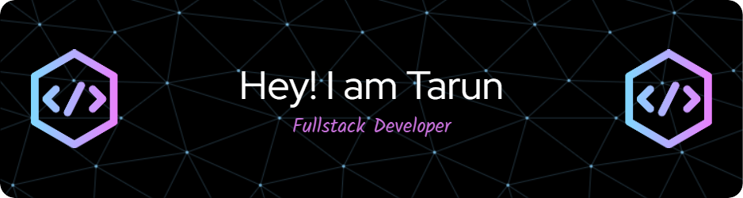

<h1 align="center">
  
</h1>

  <em>Passionate Full-Stack Developer | Code Enthusiast | Tech Explorer</em>

  
  
  
  
  

---

<h2 align="center">
   About Me
</h2>

  

  I'm a full-stack developer based on planet Earth 🌍, passionate about coding, building cool stuff, and exploring the latest technologies. My journey in tech is driven by a love for innovation and a desire to create meaningful projects that make a difference.

  🎓 Information Technology Graduate | 💼 Full Stack Developer | 🌱 Lifelong Learner | 📚 Open Source Contributor

---

<h2 align="center">🛠️ Tech Stack</h2>

<h3 align="center">Languages</h3>

  
  
  
  
  

<h3 align="center">Frameworks & Libraries</h3>

  
  
  
  
  
  

<h3 align="center">Databases & Cloud Platforms</h3>

  
  
  
  
  

<h3 align="center">Tools & Technologies</h3>

  
  
  
  
  
  

---

<h2 align="center">📊 GitHub Stats</h2>

  

  

  

---

<h2 align="center">🏆 GitHub Trophies</h2>

  

---

<h2 align="center">🎯 Current Focus</h2>

  🔭 I'm currently working on enhancing my skills in cloud-native technologies 
  🌱 I'm learning about serverless architectures and microservices 
  👯 I'm looking to collaborate on open-source projects related to web development 
  🤔 I'm seeking help with advanced DevOps practices 
  💬 Ask me about full-stack development, RESTful APIs, and database design

---

<h2 align="center">🌐 My Website</h2>

  

---

<h2 align="center">🎉 Fun Facts</h2>

  🎸 I play guitar in my free time 
  🍳 I'm an amateur chef and love experimenting with new recipes 
  🏃‍♂️ I enjoy running and have completed two half-marathons

---

  <em>Let's connect and build amazing things together! 🚀</em>

  

